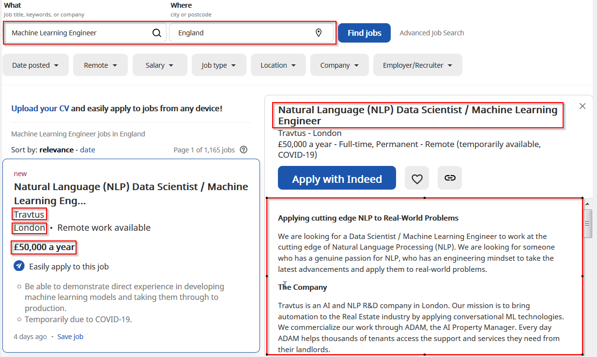
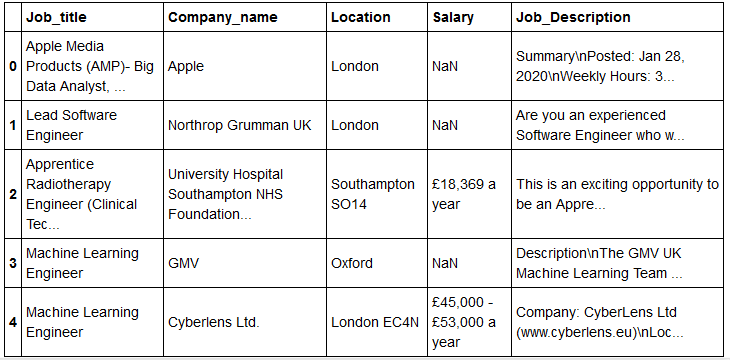
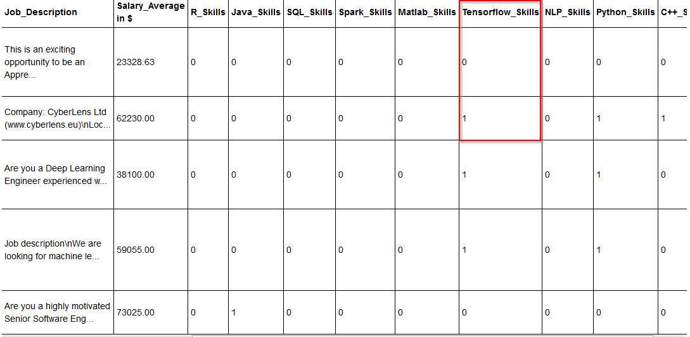
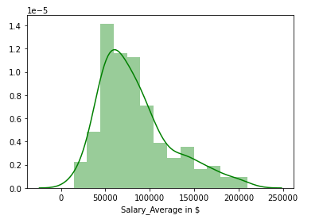
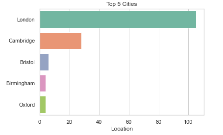
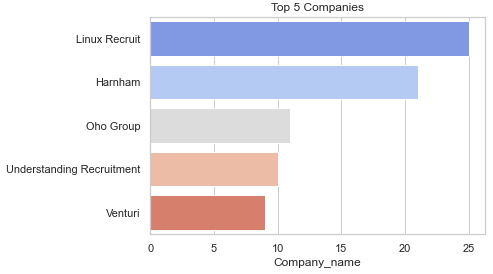
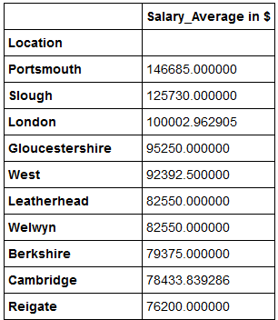
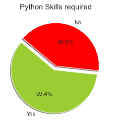
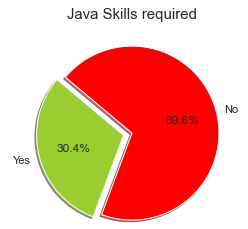
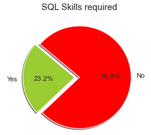

# Salary Trends for Machine Learning- Project Overview

+ [Table of Contents](#sub-sub-heading-1)
    + [Credits](#credits)
    + [Project Goal and procedure](#project-goal-and-procedure)
    + [Code and Resources](#code-and-resources)
    + [Part 1- Scraping Data with Selenium](#part-1--Scraping-data-with-selenium)
    + [Part 2- Data Cleaning and Feature Engineering](#part-2--Data-cleaning-and-feature-engineering)
    + [Part 3- Data Visualization and insigths](#part-3--data-visualization-and-insigths)
    + [Part 4- Project Limitation and Conclusion](#part-4--project-limitation-and-conclusion)
    
  

 ### Credits: 
A big thank you goes to [KenJee](https://www.youtube.com/channel/UCiT9RITQ9PW6BhXK0y2jaeg), [Codebasics](https://www.youtube.com/channel/UCh9nVJoWXmFb7sLApWGcLPQ), [Krish Naik](https://www.youtube.com/user/krishnaik06), [Keith Galli](https://www.youtube.com/channel/UCq6XkhO5SZ66N04IcPbqNcw)  and to the whole [Edureka Team](https://www.youtube.com/user/edurekaIN) who put a lot of effort to teach people Data Science, Machine Learning, Statistics and a lot of other related topics for free.

### Project Goal and procedure: 
* Goal: Get insights about the job market for Machine Learning Engineers in England
* Scraped job information from [Indeed.com](https://de.indeed.com/) using Python and Selenium
* Saved results in a csv file and manipulated and worked with the data using the pandas package
* visualization of data using seaborn and matplotlib packages

### Code and Resources
* Python Version: 3.8
* Environment: Jupyter Notebook
* Packages: Selenium, Matplotlib, Seaborn, Numpy

## Part 1- Scraping Data with Selenium
* Job Title
* Company name
* Location
* Salary
* Job description

### Output in pandas after scraping (first 5 entries)

## Part 2- Data Cleaning and Feature Engineering
After scraping the data and storing it in csv and pandas, I had to do some cleaning steps like:
* remove rows where salary information is not availabe(before cleaning: 794 job entries, after cleaning: 211 job entries; data loss of more than 70(!))
* Changed the currency from '£' to '$'
* Extracted salary range entries (min, max) and created a new column with the average value
* Changed salary entries to numeric data
* Created different columns for chosen skills and checked if they were mentioned in the job description column ('1'=Skill required, '0'= Skill not required

  * Python Skills       
  * R Skills 
  * Java Skills
  * AWS Skills
  * Hadoop Skills
  * SQL Skills 
  * Spark Skills
  * R Skills 
  * Matlab Skills
  * Tensorflow Skills 
  * NLP Skills
  
  

## Part 3- Data Visualization and insigths

#### Salary distribution

#### Top 5 job offering cities

#### Top 5 represented companies

#### Pivot table showing top 10 best paying cities in descending order

#### Top 3 most important skills according to available job description

    

## Part 4- Project Limitation and Conclusion
Since more than 70% of the data was removed due to missing salary information and we just have 211 rows with job information, I decided not to build a machine learning algorithm to predict the salary (target variable). According to my opinion the dataset is just to small. I consider for future projects to build for example a multiple linear regression model when more data is available. In order to achieve that, other job platforms like for example glassdoor.com can be observed where probably more salary information is available and can be scraped.  

